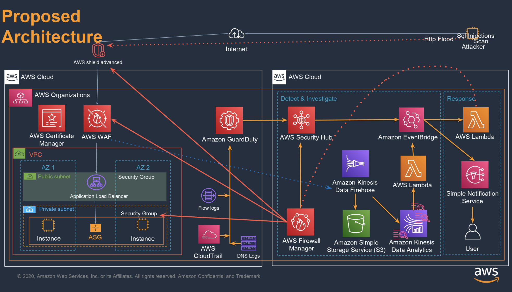

# AWS_FWM_Log_Alert
AWS Firewall Manager with central Logging and Alerting

## Proposed Architecture

## Prerequisite
1. Please make sure all AWS Firewall Manager prerequisites are met.

## Show the environments.

## Attack Scenarios

1. Observe: Scan Web Applications and do XSS and Sql injection attacks.

2. Update Firewall Manager WAF policies to protect against XSS and Sql injection attacks.

3. Automated I.R. kicks in and blocks attackers public IP address.
